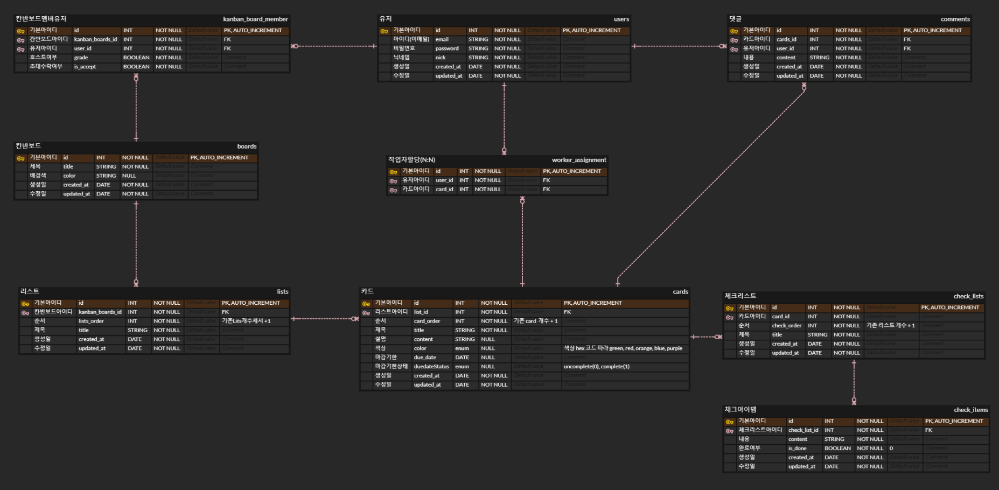

# Threello 프로젝트

- 트렐로와 같은 칸반보드 서비스 기능 구현
- 내용 : 칸반보드 워크플로우 서비스 기능을 Nest.js와 TypeORM으로 구현합니다.

## 👋 Threello 팀 소개

- **Threello**는 3조인 저희 조 번호와 트렐로를 합친 이름입니다.

## 👨‍💻 팀원

<table>
  <tbody>
    <tr>
      <td align="center"><a href="https://github.com/choisooyoung-dev"> <b> 팀장 : 최수영 </b></a> </td>
      <td align="center"><a href=https://github.com/smy1308"> <b> 팀원 : 손민영 </b></a> </td>
      <td align="center"><a href="https://github.com/visitor17564"> <b> 팀원 : 정창일 </b></a> </td>
      <td align="center"><a href="https://github.com/sangkwonlee1722"> <b> 팀원 : 이상권 </b></a> </td>
      <td align="center"><a href="https://github.com/wlals7565"> <b> 팀원 : 이정훈 </b></a> </td>
    </tr>
  </tbody>
</table>

## 👥 팀 구성원 및 역할

- **손민영**

  - 댓글 담당

- **정창일**

  - 와이어프레임 설계
  - 리스트, 체크리스트 담당

- **이상권**

  - 보드 담당

- **이정훈**

  - 회원, 인증 담당
  - ERD 설계

- **최수영**

  - 카드 담당

## ✅ 기술 스택

<!-- 프로젝트에 사용된 기술 스택을 나열 -->

## 🗃 ERD

## ✅ 주요 기능
